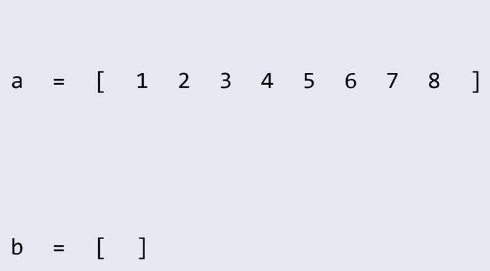

# Alternating Sort
You are given an array of integers a. A new array b is generated by rearranging the elements of a in the following way:

* b[0] is equal to a[0];
* b[1] is equal to the last element of a;
* b[2] is equal to a[1];
* b[3] is equal to the second-last element of a;
* b[4] is equal to a[2];
* b[5] is equal to the third-last element of a;
* and so on.

Here is how this process works:

Your task is to determine whether the new array b is sorted in strictly ascending order or not.

### Example 1
For a = [1, 3, 5, 6, 4, 2], the output should be alternatingSort(a) = true.
The new array b will look like [1, 2, 3, 4, 5, 6], which is in strictly ascending order, so the answer is true.

### Example 2
For a = [1, 4, 5, 6, 3], the output should be alternatingSort(a) = false.
The new array b will look like [1, 3, 4, 6, 5], which is not in strictly ascending order, so the answer is false.

### Input/Output

* [execution time limit] 4 seconds (py3)
* [input] array.integer a
    * The given array of integers.
    * Guaranteed constraints:
        * 1 ≤ a.length ≤ 105,
        * -109 ≤ a[i] ≤ 109.
* [output] boolean
    * A boolean representing whether the new array b will be sorted in strictly ascending order or not.

### Analysis
* Time Complexity: O(n)
